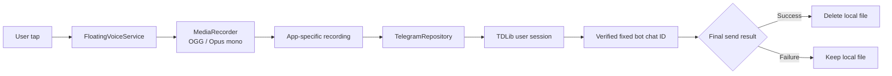

<div align="center">


[한국어](README.md) | **English**

# Floating Voice

### Tap over any app, speak, and send

Tap the floating microphone once to start recording.<br>
Tap it again to send a voice message from your Telegram account to a verified bot chat.


</div>

> [!NOTE]
> This is an unofficial, independent app. It is not distributed or endorsed by Telegram. It signs in as a regular user through the official **TDLib** library and does not automate the Telegram app UI.

> [!WARNING]
> Starting with `v0.4.1`, GitHub Releases provide a **release-signed arm64 APK**. This is not a Play Store distribution, so Android may display an unknown-source installation warning. An AAB, Play Data Safety declarations, and a complete local-data deletion flow are not ready.

[License](LICENSE) · [Privacy notice](PRIVACY.md) · [Security policy](SECURITY.md) · [APK signing](docs/SIGNING.md) · [Contributing](CONTRIBUTING.md)

---

## At a glance

| Item | Current behavior |
|:---|:---|
| **Start recording** | Tap the green floating microphone |
| **Stop and send** | Tap the red stop button |
| **Audio format** | OGG / Opus / mono / 48 kHz |
| **Sender** | The signed-in Telegram user account |
| **Recipient** | A fixed Telegram bot chat verified by username |
| **Send API** | TDLib `InputMessageVoiceNote` + `SendMessage` |
| **Success condition** | Confirmed only after `UpdateMessageSendSucceeded` |
| **Failure handling** | Keeps the recording locally instead of deleting it |
| **Display languages** | System default, 한국어, or English |
| **Supported devices** | Android 10 or newer, `arm64-v8a` |

## Why this exists

Floating Voice removes the repeated steps of opening Telegram, locating a chat, and finding the recording control whenever you want to leave a short voice note.

- The recording control stays visible while you use other apps.
- Telegram UI changes do not affect the sending path.
- Messages are sent only to the previously verified fixed target.
- Saving settings or signing in never sends a test message.

## How it works

```text
Tap floating microphone
          │
          ▼
   Record OGG/Opus
          │
          ▼
 Tap red stop button
          │
          ▼
Re-check fixed target → Send through TDLib → Confirm success → Delete local file
                                          └→ Failure → Keep recording
```

1. Complete Telegram sign-in and target verification in the app.
2. Tap **Allow / check required permissions** and grant microphone, notifications, and display-over-other-apps access.
3. While the app screen is visible, tap **Start floating voice button**.
4. Tap the green microphone to start recording.
5. Tap the red stop button to finish and send.
6. Drag the button to move it. A drag gesture is not treated as a tap.

> [!IMPORTANT]
> A message being accepted into TDLib's send queue is not considered final success. The local recording is deleted only after the final success update arrives.

## Language selection

Floating Voice includes complete Korean and English resources.

- **System default** follows the device language.
- **한국어** keeps the app in Korean regardless of the device language.
- **English** keeps the app in English regardless of the device language.
- On Android 13 or newer, the selection is synchronized with the system's per-app language settings.
- On Android 10–12, AppCompat persists the same selection locally.

The selected language applies to the settings screen, authentication state, validation errors, floating-button accessibility labels, foreground-service notification, and TDLib operation status.

## Initial configuration

| Field | Purpose | Persisted? |
|:---|:---|:---:|
| **Telegram API ID** | Numeric ID from API development tools at [my.telegram.org](https://my.telegram.org) | Encrypted |
| **Telegram API Hash** | 32-character hash from the same page | Encrypted |
| **Phone number** | International format, for example `+8210XXXXXXXX` | Encrypted |
| **Target bot username** | `@username` of the fixed recipient bot | Encrypted |
| **Telegram login code** | Code sent by Telegram during sign-in | No |
| **Two-step verification password** | Entered only when Telegram requests it | No |
| **Email and email code** | Entered only when the authorization state requests them | No |

Fields that are not needed for the current authorization step are hidden. API Hash and password fields are masked on screen.

## Why each permission is used

| Permission | Purpose | When used |
|:---|:---|:---|
| `INTERNET` | TDLib communication with Telegram servers | Sign-in, target verification, sending |
| `RECORD_AUDIO` | Records only after the user taps the floating control | During an active recording |
| `SYSTEM_ALERT_WINDOW` | Displays the control over other apps | While the user-started service is active |
| `POST_NOTIFICATIONS` | Shows service state and the stop action | Android 13 or newer |
| `FOREGROUND_SERVICE_MICROPHONE` | Complies with current background microphone rules | While the floating service is active |
| `FOREGROUND_SERVICE_SPECIAL_USE` | Maintains the persistent, user-enabled overlay | While the floating service is active |

The service must be started by the user from a visible Activity. It does not silently restart after process death or reboot and returns `START_NOT_STICKY`.

## Security and data handling

### Data stored on the device

- Telegram API ID and API Hash
- Account phone number
- Target bot username and the verified chat ID/title
- TDLib database encryption key
- TDLib local session data
- Recordings that have not received final send-success confirmation

### Applied protections

- Settings are encrypted with AES-GCM using a non-exportable AES-256 key in Android Keystore.
- Login codes and two-step verification passwords are never persisted and their fields are cleared after submission.
- Cloud backup and device-to-device transfer of app data are disabled.
- Cleartext HTTP traffic is disabled.
- The floating service is `exported=false`, so another app cannot invoke it directly.
- Real API IDs, hashes, phone numbers, or tokens are not embedded in source, resources, or build settings.
- Login data and recordings are not sent to a separate developer-operated server.

### Recording lifecycle

| State | Handling |
|:---|:---|
| Recording | Stored under app-specific `Music/voice_notes/` |
| Waiting for TDLib result | Retained until the final success update |
| Final send success | Local recording is deleted |
| Immediate rejection or final failure | Recording is retained for recovery |
| Service stopped while recording | Partial file is retained and never auto-sent |

Screenshots are currently allowed. Before sharing the settings screen, verify that no phone number, API ID, API Hash, username, or account details are visible.

## Fixed-target safeguards

A username is never accepted as the target without verification.

1. Resolve the username with `SearchPublicChat`.
2. Require the result to be a private one-to-one chat.
3. Load the user with `GetUser` and require `UserTypeBot`.
4. Encrypt and save the verified chat ID, title, and username.
5. Re-check that the current configuration still matches the fixed target immediately before sending.
6. Ignore stale asynchronous results that started before the username or client changed.

The current implementation supports only Telegram bots that have a public username.

## Architecture



### Modules

| Module | Responsibility |
|:---|:---|
| `:app` | Settings and auth UI, permissions, overlay service, recording and send status |
| `:core` | Android-independent validation, username normalization, and JUnit tests |
| `:tdlib` | Local contract for generated Java bindings and JNI from the same TDLib revision |

### Main classes

```text
FloatingVoiceApp        Owns app-wide encrypted settings and the TDLib client
MainActivity            Settings, sign-in, target verification, permissions, service control
FloatingVoiceService    Floating control, drag handling, and OGG/Opus recording
TelegramRepository      TDLib auth state, target verification, sending, result tracking
SecureSettingsStore     Android Keystore-backed encrypted settings
PendingRecordingStore   Maps temporary message IDs to recording files
LocalizedStrings        Resolves the active app locale for non-Activity components
```

## Build from source

> [!CAUTION]
> Generated TDLib Java/JNI artifacts and `vendor/` are intentionally not committed. A fresh clone cannot build the full app until the required TDLib artifacts are provided.

### Pinned environment

| Item | Version |
|:---|:---|
| JDK | 17 |
| compileSdk / targetSdk | 36 / 36 |
| minSdk | 29 |
| Android Gradle Plugin | 8.13.0 |
| Gradle wrapper | 8.13 |
| AndroidX AppCompat | 1.7.1 |
| NDK | 28.2.13676358 |
| CMake | 3.22.1 |
| ABI | `arm64-v8a` |
| TDLib source | `022d60202e446ad1287b9fb68e687c8a0760788b` |

### Prepare TDLib with Docker

On Linux or macOS with Docker running, use the wrapper below. It builds with the official TDLib Dockerfile and installs the generated Java/JNI artifacts from the pinned revision. The wrapper adds compiler prefix mapping and rejects native libraries that still contain private local paths or the container build root.

```bash
./scripts/build-tdlib-docker.sh
```

The wrapper pins:

- TDLib commit: `022d60202e446ad1287b9fb68e687c8a0760788b`
- Android NDK: `28.2.13676358`
- OpenSSL: `OpenSSL_1_1_1w`
- TDLib interface: `Java`
- Android STL: `c++_static`

The official Docker flow builds multiple ABIs, but the project installs only `arm64-v8a/libtdjni.so`. Operating-system packages inside the build image can change over time, so this is a pinned-source compatible rebuild path, not a guarantee of a byte-for-byte identical ZIP. The audit worktree, `tdlib.zip`, and a provenance file recording the fixed build inputs, prefix mapping, native-path scan result, and ZIP SHA-256 remain under the gitignored `tdlib-dist/` directory.

Replace existing local artifacts only when intended:

```bash
TDLIB_OVERWRITE=1 ./scripts/build-tdlib-docker.sh
```

If `tdlib.zip` was previously produced by this wrapper, install it with the SHA-256 recorded in that build's provenance file. Recomputing a downloaded ZIP's digest on the spot and treating it as trusted does not establish provenance.

```bash
./scripts/install-tdlib-from-zip.sh /absolute/path/to/tdlib.zip EXPECTED_SHA256
```

The installer checks the SHA-256, required Java entries, and 64-bit arm64 ELF format, then stages and replaces the entire `tdlib/src/main` directory. On replacement failure it restores the previous directory, preventing a mixed Java/JNI revision.

### Required TDLib artifacts

```text
tdlib/src/main/java/org/drinkless/tdlib/Client.java
tdlib/src/main/java/org/drinkless/tdlib/TdApi.java
tdlib/src/main/jniLibs/arm64-v8a/libtdjni.so
```

Use the Java-interface output produced by the official TDLib Dockerfile/`example/android/build-tdlib.sh` flow. Java bindings and JNI must come from the same TDLib revision.

### Build and verify

```bash
export JAVA_HOME=$(/usr/libexec/java_home -v 17)
./gradlew clean test lintDebug assembleDebug
```

`tdlib:verifyTdlibArtifacts` fails early if the generated Java API or `arm64-v8a/libtdjni.so` is missing.

Recommended final APK checks:

```bash
apksigner verify --verbose app.apk
zipalign -c -P 16 -v 4 app.apk
aapt2 dump badging app.apk
shasum -a 256 app.apk
```

## Project structure

```text
floating-voice-android/
├── app/                  Android app, locale resources, and UI assets
├── core/                 Pure Java validation and tests
├── tdlib/                Local generated TDLib Java/JNI contract
├── design/               Launcher source, adaptive foreground, and QA sheet
├── gradle/               Gradle wrapper
├── scripts/              TDLib Docker build and artifact-install wrappers
├── LICENSE               Apache License 2.0
├── PRIVACY.md            Bilingual privacy notice
├── SECURITY.md           Private vulnerability-reporting policy
├── README.md             Korean documentation
├── README.en.md          English documentation
└── settings.gradle
```

## App icon

<div align="center">

</div>

- Square legacy launcher icon
- Circular adaptive-icon mask preview
- Actual 48 px downscaled samples
- Separate white microphone and stop vectors for the floating control

## Troubleshooting

<details>
<summary><b>The floating control does not appear</b></summary>

Use **Allow / check required permissions** to verify display-over-other-apps access. The service does not start until Telegram authorization and target verification are complete.
</details>

<details>
<summary><b>Recording does not start</b></summary>

Check microphone permission, return to a visible app screen, and start the floating service again. Android 14 or newer does not allow an arbitrary background start of a microphone foreground service.
</details>

<details>
<summary><b>The voice message is not sent</b></summary>

Check the authorization and fixed-target status in the app. Failed recordings are not deleted and may remain under the app-specific `voice_notes/` directory.
</details>

<details>
<summary><b>The language did not change</b></summary>

Select the language again in the app. On Android 13 or newer, you can also open system settings for Floating Voice and choose a language under **App language**. **System default** clears the per-app override.
</details>

<details>
<summary><b>The session was lost after an update</b></summary>

The package ID has been `com.sidequestlab.floatingvoice` since version 0.2.0. The older `com.sidequestlab.messvoice` package is a separate installation and its session is not migrated. Updates from version 0.2.0 onward use the same package.
</details>

## Current limitations

- The official APK is a GitHub Release sideload artifact, not a Play Store production artifact.
- Only `arm64-v8a` is included; 32-bit devices and x86 emulators are unsupported.
- Users, private groups, and private channels without a public bot username cannot be selected as targets.
- The app uses a personal setup in which each user enters their own Telegram API ID and API Hash.
- Logout revokes the Telegram session but there is no single action that erases every local setting and retained recording.
- Failed recording files remain as unencrypted OGG files in app-specific storage.

## Distribution policy

- GitHub Releases provide the source ZIP/TAR and a release-signed `arm64-v8a` APK for the tag.
- APKs are never committed to Git; they are attached only as GitHub Release assets.
- AABs, generated TDLib Java/JNI sources, signing keys, sessions, and recordings are not release assets.
- The official APK certificate SHA-256 fingerprint is `FD:97:82:9D:19:F8:B0:57:5B:79:EC:1E:8B:7A:26:16:A0:69:7C:EE:86:5D:29:B0:B5:28:78:3C:39:88:AB:A6`.
- Each release note records the corresponding APK file SHA-256.

## Roadmap

- [x] Korean and English app resources
- [x] System-default and in-app language selection
- [x] Korean and English repository documentation
- [x] Release-signed arm64 APK through GitHub Releases
- [ ] AAB and Play App Signing
- [x] Bilingual repository privacy notice
- [ ] Store Data Safety declaration and permission disclosures
- [ ] Logout plus complete local-data deletion
- [ ] Failed-recording list with retry and delete actions
- [ ] Review broader target-selection support
- [ ] Add privacy-safe screenshots of the settings screen and floating control
- [ ] Expand UI testing across devices and Android versions

## TDLib compatibility notes

The current source is matched to these APIs from the pinned TDLib revision:

- `SetTdlibParameters.databaseEncryptionKey`
- `SendMessage.topicId: MessageTopic`
- `InputMessageVoiceNote(InputVoiceNote, FormattedText, MessageSelfDestructType)`
- `UpdateMessageSendSucceeded.oldMessageId`
- `UpdateMessageSendFailed.oldMessageId`
- `ChatTypePrivate.userId`, `GetUser.userId`, `UserTypeBot`

Mixing another TDLib revision, interface mode, or generated Java/JNI pair may cause compile-time or runtime incompatibility.

## License and notices

Floating Voice source is released under the [Apache License 2.0](LICENSE). Copyright 2026 Namseok Yoo.

- Third-party notices: [THIRD_PARTY_NOTICES.md](THIRD_PARTY_NOTICES.md)
- TDLib: [Boost Software License 1.0](https://github.com/tdlib/td/blob/master/LICENSE_1_0.txt)
- Telegram API: [Terms of Service](https://core.telegram.org/api/terms)
- Telegram API ID: [Creating your Telegram Application](https://core.telegram.org/api/obtaining_api_id)

Telegram names and marks belong to Telegram. This project is not an official Telegram app and does not use the official Telegram logo as its app icon.
