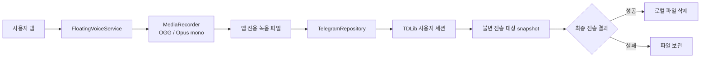

<div align="center">


**한국어** | [English](README.en.md)

# 플로팅 보이스

### 다른 앱 위에서 누르고, 말하고, 바로 보낸다

플로팅 마이크 버튼을 한 번 누르면 녹음이 시작되고,<br>
다시 누르면 내 Telegram 계정으로 확인된 봇 대화에 음성 메시지가 전송된다.


</div>

> [!NOTE]
> Telegram과 제휴하거나 Telegram이 공식 배포하는 앱이 아니다. 일반 사용자 계정으로 로그인하는 공식 **TDLib**를 사용하며, Telegram 앱 화면을 열거나 자동 조작하지 않는다.

> [!WARNING]
> `v0.4.1`부터 GitHub Release에 **release 서명된 arm64 APK**를 제공한다. Play 스토어 배포가 아니므로 Android의 출처를 알 수 없는 앱 설치 경고가 표시될 수 있다. AAB, Play Data Safety, 전체 데이터 삭제 기능은 아직 준비되지 않았다.

[라이선스](LICENSE) · [개인정보 안내](PRIVACY.md) · [보안 정책](SECURITY.md) · [APK 서명](docs/SIGNING.md) · [기여 안내](CONTRIBUTING.md)

---

## 한눈에 보기

| 항목 | 현재 동작 |
|:---|:---|
| **녹음 시작** | 초록색 플로팅 마이크 아이콘 탭 |
| **녹음 종료·전송** | 빨간색 정지 아이콘 탭 |
| **녹음 취소** | 반대편 X 버튼 탭, 메시지 미전송 |
| **텍스트 전송** | 플로팅 버튼 길게 누르기 → 텍스트 보내기 |
| **음성 형식** | OGG / Opus / mono / 48 kHz |
| **전송 주체** | 로그인한 본인의 Telegram 사용자 계정 |
| **전송 대상** | 저장된 여러 private bot 중 기본 대상 또는 이번 녹음에서 선택한 대상 |
| **전송 방식** | TDLib `InputMessageVoiceNote` + `SendMessage` |
| **성공 판정** | `UpdateMessageSendSucceeded` 수신 후 확정 |
| **실패 처리** | 녹음 파일을 삭제하지 않고 로컬에 보관 |
| **표시 언어** | 시스템 기본값, 한국어 또는 English |
| **지원 기기** | Android 10 이상, `arm64-v8a` |

## 왜 만들었나

Telegram에 짧은 음성 메모를 남기기 위해 매번 앱을 열고, 대화를 찾고, 녹음 버튼을 누르는 과정을 줄이기 위한 전용 도구다.

- 다른 앱을 쓰는 중에도 플로팅 버튼이 계속 보인다.
- Telegram UI 위치가 바뀌어도 영향을 받지 않는다.
- 미리 확인한 private bot 대상 외에는 전송하지 않는다.
- 자동 테스트 메시지나 백그라운드 자동 전송이 없다.

## 쓰는 법

```text
플로팅 마이크 탭
      │
      ▼
 OGG/Opus 녹음
      │
      ▼
빨간 정지 아이콘 탭
      │
      ▼
선택 대상 snapshot 고정 → TDLib 전송 → 성공 확인 → 로컬 파일 삭제
                              └→ 실패 → 녹음 파일 보관
```

1. 앱에서 Telegram 로그인과 대상 봇 확인을 마친다.
2. **필수 권한 허용**을 눌러 마이크·알림·다른 앱 위 표시 권한을 허용한다.
3. 앱 화면이 보이는 상태에서 **플로팅 버튼 시작**을 누른다.
4. 초록색 마이크 아이콘을 누르면 녹음이 시작된다.
5. 빨간색 정지 아이콘을 누르면 녹음을 끝내고 전송한다.
6. 버튼은 드래그해서 원하는 위치로 옮길 수 있다. 드래그 동작은 탭으로 처리되지 않는다.
7. 텍스트는 플로팅 버튼을 길게 누른 뒤 **텍스트 보내기**를 선택해 작성·전송한다.

> [!IMPORTANT]
> 전송 요청이 대기열에 들어간 것만으로 성공 처리하지 않는다. TDLib의 최종 성공 업데이트를 받은 뒤에만 녹음 파일을 삭제한다.

## 언어 선택

플로팅 보이스는 한국어와 영어 리소스를 모두 포함한다.

- **시스템 기본값**은 기기의 언어 설정을 따른다.
- **한국어**는 기기 언어와 관계없이 앱을 한국어로 표시한다.
- **English**는 기기 언어와 관계없이 앱을 영어로 표시한다.
- Android 13 이상에서는 시스템의 앱별 언어 설정과 자동으로 동기화된다.
- Android 10~12에서는 AppCompat가 같은 선택을 로컬에 보관한다.

언어 선택은 설정 화면뿐 아니라 인증 상태, 입력값 오류, 플로팅 버튼 접근성 설명, 포그라운드 서비스 알림, TDLib 처리 상태에도 적용된다.

## 처음 입력할 값

| 입력 항목 | 설명 | 저장 여부 |
|:---|:---|:---:|
| **Telegram API ID** | [my.telegram.org](https://my.telegram.org)의 API development tools에서 발급한 숫자 | 암호화 저장 |
| **Telegram API Hash** | 같은 페이지에서 발급한 32자리 값 | 암호화 저장 |
| **전화번호** | 국가번호 포함 형식, 예: `+8210XXXXXXXX` | 암호화 저장 |
| **대상 봇 username** | 추가·재검증할 private bot의 `@username` | 암호화 저장 |
| **Telegram 인증번호** | 로그인 과정에서 Telegram이 보낸 코드 | 저장하지 않음 |
| **2단계 인증 비밀번호** | 계정이 요구할 때만 입력 | 저장하지 않음 |
| **이메일·이메일 코드** | Telegram 인증 상태가 요구할 때만 입력 | 저장하지 않음 |

인증 단계에 필요하지 않은 입력칸은 자동으로 숨긴다. API Hash와 인증 비밀번호 입력칸은 화면에서 마스킹된다.

## 권한을 왜 쓰나

| 권한 | 사용 목적 | 사용 시점 |
|:---|:---|:---|
| `INTERNET` | TDLib가 Telegram 서버와 통신 | 로그인·대상 확인·전송 |
| `RECORD_AUDIO` | 사용자가 누른 동안 음성 녹음 | 플로팅 마이크 탭 이후 |
| `SYSTEM_ALERT_WINDOW` | 다른 앱 위에 플로팅 버튼 표시 | 사용자가 서비스를 시작한 동안 |
| `POST_NOTIFICATIONS` | 플로팅 서비스 상태와 종료 버튼 표시 | Android 13 이상 |
| `FOREGROUND_SERVICE_MICROPHONE` | 최신 Android의 백그라운드 마이크 정책 준수 | 플로팅 서비스 활성 중 |
| `FOREGROUND_SERVICE_SPECIAL_USE` | 사용자 시작형 지속 오버레이 유지 | 플로팅 서비스 활성 중 |

서비스는 보이는 Activity에서 사용자가 직접 시작해야 한다. 프로세스 종료나 재부팅 후 몰래 다시 시작하지 않으며 `START_NOT_STICKY`를 사용한다.

## 보안과 데이터 처리

### 기기에 저장하는 데이터

- Telegram API ID·Hash
- 계정 전화번호
- 여러 대상 봇의 username·확인된 chat ID·bot user ID·별칭·기본 대상
- TDLib 데이터베이스 암호화 키
- TDLib 로컬 세션 데이터
- 성공 확인 전의 녹음 파일

### 적용된 보호

- 설정값은 Android Keystore의 비추출 AES-256 키로 AES-GCM 암호화한다.
- 인증번호와 2단계 인증 비밀번호는 저장하지 않고 제출 직후 입력칸을 비운다.
- 앱 데이터의 클라우드 백업과 기기 간 이전을 차단한다.
- 평문 HTTP 통신을 허용하지 않는다.
- 플로팅 서비스는 `exported=false`라 다른 앱이 직접 실행할 수 없다.
- 소스·리소스·빌드 설정에 실제 API ID·Hash·전화번호·토큰을 넣지 않는다.
- 별도 개발자 서버로 로그인 정보나 음성을 전송하지 않는다.

### 녹음 파일의 수명

| 상태 | 처리 |
|:---|:---|
| 녹음 중 | 앱 전용 `Music/voice_notes/`에 저장 |
| TDLib 전송 대기 | 성공 업데이트 전까지 보관 |
| 최종 전송 성공 | 로컬 파일 삭제 |
| 즉시 거부·최종 실패 | 복구할 수 있도록 파일 보관 |
| 녹음 중 서비스 종료 | 자동 전송하지 않고 부분 파일 보관 |

현재 화면 캡처는 허용되어 있다. 설정 화면을 공유할 때는 전화번호·API ID·대상 정보가 보이지 않는지 먼저 확인해야 한다.

## 다중 전송 대상 안전장치

대상 username만 저장하고 바로 보내지 않는다.

1. `SearchPublicChat`으로 username을 찾는다.
2. 결과가 개인 대화인지 확인한다.
3. `GetUser`로 실제 `UserTypeBot`인지 확인한다.
4. 확인된 chat ID·bot user ID·계정 user ID·username을 암호화 저장한다.
5. 녹음 중 선택한 대상을 정지 시 불변 snapshot으로 고정하고 그 chat ID만 사용한다.
6. 대상 삭제·비활성화·계정 변경·오래된 비동기 결과는 차단하며 다른 대상으로 자동 폴백하지 않는다.
7. 전송 실패·불확실 상태는 원래 대상 snapshot과 녹음 파일을 보존하고 자동 재시도하지 않는다.

현재 구현은 **공개 username이 있는 Telegram 봇**만 대상으로 지원한다.

## 동작 구조



### 모듈

| 모듈 | 역할 |
|:---|:---|
| `:app` | 설정·인증 UI, 권한, 플로팅 서비스, 녹음·전송 상태 |
| `:core` | Android 비의존 설정 검증과 username 정규화, JUnit 테스트 |
| `:tdlib` | 같은 TDLib 리비전에서 생성한 Java API와 JNI를 묶는 로컬 모듈 |

### 주요 클래스

```text
FloatingVoiceApp        앱 범위 설정 저장소와 TDLib 클라이언트 소유
MainActivity            설정·로그인·대상 확인·권한·서비스 제어
FloatingVoiceService    플로팅 버튼·드래그·OGG/Opus 녹음
TelegramRepository      TDLib 인증 상태·대상 검증·음성 전송·결과 추적
SecureSettingsStore     Android Keystore 기반 설정 암호화
PendingRecordingStore   임시 메시지 ID와 녹음 파일 연결
```

## 직접 빌드

> [!CAUTION]
> 생성된 TDLib Java/JNI 파일과 `vendor/`는 저장소에 커밋하지 않는다. 새 clone은 TDLib 산출물을 먼저 준비해야 전체 앱을 빌드할 수 있다.

### 고정 개발 환경

| 항목 | 버전 |
|:---|:---|
| JDK | 17 |
| compileSdk / targetSdk | 36 / 36 |
| minSdk | 29 |
| Android Gradle Plugin | 8.13.0 |
| Gradle wrapper | 8.13 |
| AndroidX AppCompat | 1.7.1 |
| NDK | 28.2.13676358 |
| CMake | 3.22.1 |
| ABI | `arm64-v8a` |
| TDLib source | `022d60202e446ad1287b9fb68e687c8a0760788b` |

### Docker로 TDLib 준비

Docker가 실행 중인 Linux·macOS 환경에서는 다음 wrapper가 공식 TDLib Dockerfile과 고정 리비전을 사용해 Java/JNI를 준비한다. wrapper는 compiler prefix mapping을 추가하고 설치 전에 native library에서 개인 로컬 경로와 container build 경로가 제거됐는지 검사한다.

```bash
./scripts/build-tdlib-docker.sh
```

wrapper는 다음 값을 고정한다.

- TDLib commit: `022d60202e446ad1287b9fb68e687c8a0760788b`
- Android NDK: `28.2.13676358`
- OpenSSL: `OpenSSL_1_1_1w`
- TDLib interface: `Java`
- Android STL: `c++_static`

공식 Docker 빌드는 여러 ABI를 만들지만 프로젝트에는 `arm64-v8a/libtdjni.so`만 설치한다. 빌드 환경의 운영체제 패키지가 시간에 따라 달라질 수 있으므로 byte-for-byte 동일한 ZIP을 보장하지는 않으며, 고정 TDLib 소스와 도구 버전으로 호환 산출물을 재생성하는 절차다. 감사용 작업 폴더, `tdlib.zip`, 고정 빌드 입력, prefix mapping, native 경로 검사 결과, ZIP SHA-256을 기록한 provenance 파일은 Git에서 제외된 `tdlib-dist/`에 남는다.

기존 로컬 TDLib 파일을 의도적으로 교체할 때만 다음을 사용한다.

```bash
TDLIB_OVERWRITE=1 ./scripts/build-tdlib-docker.sh
```

이 wrapper로 이전에 빌드한 `tdlib.zip`이 있다면 당시 provenance 파일에 기록된 SHA-256과 함께 설치할 수 있다. 다운로드한 ZIP의 해시를 그 자리에서 새로 계산해 신뢰값처럼 사용하면 출처 검증이 되지 않는다.

```bash
./scripts/install-tdlib-from-zip.sh /absolute/path/to/tdlib.zip EXPECTED_SHA256
```

installer는 SHA-256 일치, Java 산출물 존재, arm64 64-bit ELF 형식을 확인한 뒤 `tdlib/src/main` 전체를 staging하여 교체한다. 교체 실패 시 이전 디렉터리를 복원해 Java/JNI가 서로 다른 리비전으로 섞이지 않게 한다.

### 필요한 TDLib 산출물

```text
tdlib/src/main/java/org/drinkless/tdlib/Client.java
tdlib/src/main/java/org/drinkless/tdlib/TdApi.java
tdlib/src/main/jniLibs/arm64-v8a/libtdjni.so
```

공식 TDLib Dockerfile/`example/android/build-tdlib.sh`의 Java 인터페이스 결과를 사용한다. Java와 JNI는 반드시 같은 TDLib 리비전에서 만들어야 한다.

### 빌드·검증

```bash
export JAVA_HOME=$(/usr/libexec/java_home -v 17)
./gradlew clean test lintDebug assembleDebug
```

`tdlib:verifyTdlibArtifacts`는 Java API 또는 `arm64-v8a/libtdjni.so`가 빠졌을 때 빌드 초기에 실패한다.

최종 APK 검증 기준:

```bash
apksigner verify --verbose app.apk
zipalign -c -P 16 -v 4 app.apk
aapt2 dump badging app.apk
shasum -a 256 app.apk
```

## 프로젝트 구조

```text
floating-voice-android/
├── app/                  Android 앱·언어 리소스·UI 자산
├── core/                 순수 Java 설정 검증·테스트
├── tdlib/                생성된 TDLib Java/JNI 로컬 모듈 계약
├── design/               앱 아이콘 원본·adaptive foreground·QA 시트
├── gradle/               Gradle wrapper
├── scripts/              TDLib Docker 빌드·산출물 설치 wrapper
├── LICENSE               Apache License 2.0
├── PRIVACY.md            한국어·영어 개인정보 안내
├── SECURITY.md           비공개 취약점 제보 정책
├── README.md             한국어 문서
├── README.en.md          영문 문서
└── settings.gradle
```

## 앱 아이콘

<div align="center">

</div>

- 정사각형 legacy launcher 아이콘
- 원형 adaptive icon 마스킹
- 실제 48 px 축소 상태
- 플로팅 버튼은 별도의 흰색 마이크·정지 벡터 아이콘 사용

## 안 될 때

<details>
<summary><b>플로팅 버튼이 나타나지 않음</b></summary>

앱의 **필수 권한 허용**에서 다른 앱 위 표시 권한을 확인한다. Telegram 로그인이 완료되고 대상 봇이 확정되지 않으면 서비스가 시작되지 않는다.
</details>

<details>
<summary><b>녹음이 시작되지 않음</b></summary>

마이크 권한을 확인하고 앱 화면이 보이는 상태에서 플로팅 서비스를 다시 시작한다. Android 14 이상은 백그라운드에서 임의로 마이크 foreground service를 시작하지 못한다.
</details>

<details>
<summary><b>음성이 전송되지 않음</b></summary>

설정 화면의 인증 상태와 선택한 전송 대상 상태를 확인한다. 실패하거나 결과가 불확실한 녹음은 삭제하지 않으므로 앱 전용 `voice_notes/` 경로에 남아 있을 수 있다.
</details>

<details>
<summary><b>앱 업데이트 후 로그인이 풀림</b></summary>

`0.2.0`부터 패키지 ID는 `com.sidequestlab.floatingvoice`이다. 이전 `com.sidequestlab.messvoice` 앱과는 별도 설치이며 세션이 자동 이전되지 않는다. `0.2.0` 이후 버전끼리는 같은 패키지를 사용한다.
</details>

## 현재 제약

- 공식 APK는 GitHub Release에서만 제공하는 sideload용 산출물이며 Play 스토어 배포용이 아니다.
- `arm64-v8a`만 포함하므로 32비트 기기와 x86 에뮬레이터는 지원하지 않는다.
- 공개 username이 없는 사용자·비공개 그룹·비공개 채널은 대상으로 선택할 수 없다.
- 각 사용자가 자신의 Telegram API ID·Hash를 입력하는 개인용 구조다.
- 로그아웃은 Telegram 세션을 해제하지만 모든 로컬 설정·녹음을 한 번에 지우는 기능은 아직 없다.
- 실패 녹음 파일은 앱 전용 저장소에 평문 OGG로 남는다.

## 배포 정책

- GitHub Release에는 태그 시점의 소스 ZIP/TAR와 release 서명된 `arm64-v8a` APK를 제공한다.
- 현재 및 출시용 tree에는 APK를 추적하지 않고, 공식 APK는 Release asset으로만 첨부한다. 과거 내부 feature-branch commit에 포함된 debug 테스트 APK는 공식 산출물이나 배포 증빙으로 인정하지 않는다.
- AAB·TDLib Java/JNI 원본·서명키·세션·녹음은 Release asset으로 배포하지 않는다.
- 공식 APK 서명 인증서 SHA-256 fingerprint는 `FD:97:82:9D:19:F8:B0:57:5B:79:EC:1E:8B:7A:26:16:A0:69:7C:EE:86:5D:29:B0:B5:28:78:3C:39:88:AB:A6`이다.
- APK 파일의 SHA-256은 각 Release Notes에 별도로 기록한다.

## 제품 개발 로드맵

버전별 범위·선행검증·리스크·완료 게이트의 단일 기준은 [Floating Voice Release Master Plan](docs/plans/floating-voice-release-master.md)이다.

- 현재 안정 기준선: [`v0.7.0`](https://github.com/namseokyoo/floating-voice-android/releases/tag/v0.7.0) — 다중 private bot 목적지·불변 dispatch·A52s 검증 완료
- `v0.8.0`: 시스템 STT 텍스트 공유·Android Sharesheet·로컬 OGG 출력 — 다음 개발 단계
- `v0.9.0`: 메인 버튼 역할 지정
- `v0.10.x+`: 실사용 안정화
- `v1.0.0`: 안정성 게이트 충족 후에만 진입

### 출시 준비 참고 — 제품 기능 로드맵 아님

아래 항목은 Play Store나 공개 배포를 결정했을 때 사용하는 별도 체크리스트다. 버전별 기능 순서나 다음 개발 범위를 결정하지 않는다.

- [x] 한국어·영어 리소스·문서·개인정보 안내
- [x] release 서명 `arm64-v8a` APK 체계
- [ ] AAB와 Play App Signing 구성
- [ ] 스토어용 Data Safety·권한 고지
- [ ] 실제 설정 화면·플로팅 버튼 스크린샷
- [ ] 기기·Android 버전별 UI 테스트 확대

## TDLib 호환성 주의

현재 코드는 고정 TDLib 리비전의 다음 API 형태에 맞춰져 있다.

- `SetTdlibParameters.databaseEncryptionKey`
- `SendMessage.topicId: MessageTopic`
- `InputMessageVoiceNote(InputVoiceNote, FormattedText, MessageSelfDestructType)`
- `UpdateMessageSendSucceeded.oldMessageId`
- `UpdateMessageSendFailed.oldMessageId`
- `ChatTypePrivate.userId`, `GetUser.userId`, `UserTypeBot`

다른 TDLib 리비전이나 JSON/JSONJava 인터페이스를 섞으면 컴파일 오류 또는 런타임 불일치가 발생할 수 있다.

## 라이선스와 고지

Floating Voice 소스는 [Apache License 2.0](LICENSE)으로 공개한다. Copyright 2026 Namseok Yoo.

- 제3자 고지: [THIRD_PARTY_NOTICES.md](THIRD_PARTY_NOTICES.md)
- TDLib: [Boost Software License 1.0](https://github.com/tdlib/td/blob/master/LICENSE_1_0.txt)
- Telegram API: [Terms of Service](https://core.telegram.org/api/terms)
- Telegram API ID: [Creating your Telegram Application](https://core.telegram.org/api/obtaining_api_id)

Telegram 이름과 로고는 Telegram의 상표다. 이 프로젝트는 공식 Telegram 앱이 아니며 공식 Telegram 로고를 사용하지 않는다.
